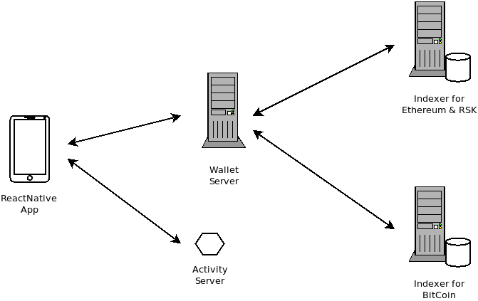

# MelloWallet Architecture

## Components

The whole architecture includes a mobile app that can run in Android or iOS. For the mobile app to work it requires a Wallet server, and an indexer for each used network. Additionally there is a Activity server component for pushing updates (balance changes etc.) into the app.

### Mobile App

It was developed in React Native (which allows to have a single codebase for Android and iOS). It also uses a framework called Expo which facilitates the QA and UI development. Even though this framework it is used, the final product makes an exception to use native random generation instead of the Expo library. The native random generation drastically improves the security of the generated cryptographic keys.

One important responsability of the mobile app it to store the private keys for the user and to sign transactions.

The application is divided into two distict components:

-   A UI module
-   A crypto and comms library

The UI module handles all the user interaction. The crypto and comms library handles the cryptography tasks like creation of addresses, signing transactions, etc., as well as all the communication with the server.

### Wallet Server

It handles the interaction with the blockchain. It provides a single way for the Mobile App to interact with different networks. It also provides a simple interface to the indexers.

### Activity Server

It provides updates on events happenning on the blockchain. The Mobile App can subscribe to specific events and this server will push notifications when those events happen. An example use is to update the balance and history of the wallet automatically after a transaction has been made. The user does not need to keep refreshing/polling for an update, the Activity Server will push it when it becomes available.

### Indexers

They provide an efficient way to access blockchain history and account balances.
